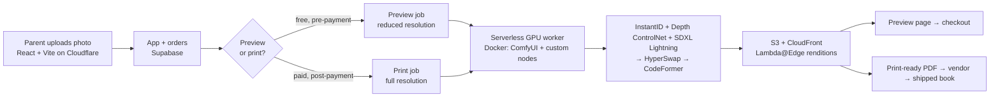

# TalesBerry — AI Engineering Case Study

**What is TalesBerry?** TalesBerry turns a photo of a
child into a personalised, photo-realistic storybook in which that child is the illustrated hero.
Parents upload one photo, get a free preview in minutes, and order a printed book.

This repository is the **engineering documentation** for that system - architecture, the diffusion
pipeline, GPU cost and performance work, incidents, and the decisions behind them. It is not the
production codebase; no application source, credentials, customer data or infrastructure
identifiers are published here, obviously! :)

---

## The system in one diagram

Detail: **[docs/architecture.md](docs/architecture.md)** · the free path and the paid path are
deliberately different systems — see [ADR-004](docs/adr/004-two-tier-preview-and-print-resolution.md).

---

## Why this was hard

A face-swap demo is a weekend project. A hyper personalisation **business** is not. The constraints that shaped
every decision here:

| Constraint | Consequence |
|---|---|
| The customer is the buyer's child | Resemblance failure is not a bad output, it is a refund and a bad review |
| Previews are free, prints are paid | Most GPU spend is on sessions that never convert |
| 20+ illustrated pages per book | Per-image latency multiplies across the whole book |
| Gross margin is fixed by print cost | GPU cost per book is a direct line item, not an abstraction |

---

## Engineering case studies

| # | Document | What it shows |
|---|---|---|
| 1 | [System architecture](docs/architecture.md) | End-to-end design, request flow, sync vs async boundaries, failure modes |
| 2 | [The image pipeline, node by node](docs/image-pipeline.md) | Why each model is in the graph, what breaks without it, what it costs |
| 3 | [GPU performance and cost](docs/performance-and-cost.md) | Where the seconds and the rupees actually go, and the two-tier render decision |
| 4 | [Web performance](docs/web-performance.md) | LCP 9.5s → 2.6s on the homepage; SPA → static prerendering migration |
| 5 | [Scaling design](docs/scaling.md) | What changes at 10× and 100× volume, and what breaks first |

Supporting material:

- [Production debugging notes](docs/debugging-notes.md) — four real failures and how they were isolated
- [Incident: GPU tier instability](docs/incidents/2026-runpod-gpu-tier-instability.md)
- [Architecture decision records](docs/adr/) — the decisions, the options rejected, and the trade-offs accepted
- [Security and privacy](docs/security-and-privacy.md) — handling photographs of children

---

## Tech stack

**Inference** ComfyUI · SDXL · SDXL-Lightning LoRA · InstantID · ControlNet (depth) · InsightFace ·
HyperSwap / ReActor · CodeFormer · PyTorch · CUDA · ONNX Runtime

**Infrastructure** RunPod Serverless · Docker · AWS S3 · CloudFront · Lambda@Edge · Cloudflare
Workers · Supabase

**Application** React · Vite · TypeScript · vite-react-ssg · Python

---

## My role

<!-- FILL: state this precisely and honestly — it is the first thing a hiring manager will test. -->
Founder and product head at TalesBerry. I designed and built the generation pipeline and the
infrastructure it runs on, and I own the product, the funnel and the unit economics. TalesBerry is
a small founding team; this repository documents the work I did personally.

## About

I'm Vimal Jangid — ~13 years in product, most recently PM at Google (Core Data Platforms) and head
of Grab's Trust portfolio (8 PMs, Grab CEO Award). TalesBerry is where I build the whole thing
myself: model pipeline, GPU infrastructure, web performance, ads and P&L.

[LinkedIn](https://www.linkedin.com/in/vimaljangid/) · [talesberry.com](https://talesberry.com)

---

*Documentation and sanitised examples in this repository are released under
[CC BY 4.0](LICENSE). The TalesBerry product, artwork and production code are not open source.*
