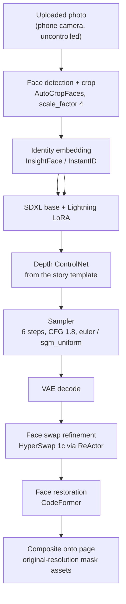

# The image pipeline, node by node

The interesting part of TalesBerry is not that it puts a child's face in a picture book. It is that
the face has to be *recognisably that child* on 20+ pages, at different angles, in a consistent
illustrated style, on a budget of a few rupees a page.

This document explains what is in the graph, why, and what happens if you remove it.

## The graph

## Why each stage exists

### 1. Face detection and crop — `AutoCropFaces`, `scale_factor 4`

Input photos are whatever a parent had on their phone: group shots, sunglasses, motion blur,
sideways faces. Everything downstream assumes a reasonably framed face, so this stage is the
contract between the messy real world and the pipeline.

The `scale_factor 4` crop margin matters more than it looks. Too tight and InstantID loses the
hairline and jaw, which is where family resemblance actually lives. Too loose and background
detail bleeds into the identity embedding.

**Remove it:** identity quality becomes a function of how well the parent framed the photo — which
is to say, unacceptable.

### 2. Identity conditioning — InstantID, weight `1.15`

InstantID carries the identity from a single photo into generation without per-customer training.
Weight 1.15 is deliberately above the usual default: at lower weights the output drifts toward a
generic pretty child, which is the exact failure mode that produces "this doesn't look like my
daughter" refunds.

The cost of pushing it up is rigidity — expression and pose follow the source photo more closely.
For this product that trade is correct. Resemblance beats variety.

**Remove it:** you have a nice illustration of someone else's child.

### 3. Structural conditioning — Depth ControlNet, weight `0.35`

The story art is fixed: the child must stand where the illustration expects a child to stand, at
the right scale, facing the right way. Depth conditioning from the template enforces that.

0.35 is low on purpose. Higher weights lock the geometry so hard that the face flattens toward the
template rather than the child. Lower and characters drift out of the scene composition.

**Remove it:** correct face, wrong body placement, broken page layout.

### 4. Generation — SDXL with a Lightning 4-step LoRA: 6 steps, CFG 1.8, `euler` / `sgm_uniform`

The whole economic argument of this pipeline lives in this line. Standard SDXL sampling at 25–40
steps produces marginally better images at roughly 5× the GPU time — and GPU time is a direct cost
per book, most of it spent on previews that never convert.

6 steps rather than the LoRA's nominal 4: at 4 the detail in the illustrated background falls apart
under the later face-swap composite. CFG 1.8 because Lightning-style distillation breaks down at
normal guidance scales.

**Remove it:** roughly 5× the cost and latency for a quality difference customers do not notice
under a face swap and a restoration pass.

### 5. Face swap refinement — HyperSwap 1c via ComfyUI-ReActor

InstantID gets identity approximately right at the level of "this is the same kind of face." A
dedicated swap pass gets it right at the level of "that is my son." The two are complementary:
diffusion-time conditioning keeps the face *in the scene's style and lighting*, and the swap pass
corrects the geometry the diffusion model drifted on.

**Remove it:** resemblance drops to "looks a bit like him," which is the difference between a gift
and a disappointment.

### 6. Restoration — CodeFormer

The swap output carries compression and resampling artefacts. CodeFormer restores facial detail
before the page is composited. On a 220 GSM printed page, artefacts that are invisible on a phone
screen are clearly visible.

**Remove it:** acceptable previews, disappointing prints.

### 7. Compositing — always at original asset resolution

See [debugging-notes.md](debugging-notes.md#3-resizing-mask-assets-degrades-output-even-back-to-the-original-size).
Resizing mask assets — even resizing them back to their own original dimensions — measurably
degrades output, because sub-pixel boundary shifts compound through depth estimation and identity
conditioning. Source assets are used unmodified, and that is a hard rule in the pipeline.

## The lesson that generalises: more models is not better

An earlier version of this graph stacked additional enhancement and upscaling stages on the theory
that each one could only help. It did not help. Every stage adds VRAM pressure, latency, a failure
mode, and — most damaging — its own opinion about what a face should look like. Stages fight each
other: a restoration model will happily undo the identity work of the stage before it.

The production graph is the smallest set of stages where each one is load-bearing, and each one has
a measured cost. That is the difference between assembling a pipeline and engineering one.

## Model bias is a production concern, not a footnote

Prompting this pipeline with the token `indian` causes SDXL to reach for stereotype: it
hallucinates bindis onto children who are not wearing one and systematically darkens skin tone
relative to the source photo. For a product whose entire customer base is Indian families, that is
not an academic fairness discussion — it is a defect that produces a child who does not look like
herself.

The mitigation is to remove the token from the prompt path entirely and let identity conditioning
carry ethnicity from the actual photograph, with stacked negative weights as a backstop. The
general principle: **do not let the text encoder describe the customer. Let the photograph do it.**

---

*Parameter values here are the production configuration at time of writing. The full workflow graph
is not published.*
